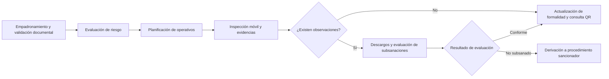

# Necesidad del negocio de SIFITUR Huamanga

## Problema y contexto

SIFITUR Huamanga busca modernizar el proceso de fiscalización de hospedajes y servicios turísticos de la provincia de Huamanga. La propuesta describe un flujo manual en papel que debe articular el padrón de prestadores, la inspección en campo, la revisión de documentos y el seguimiento de subsanaciones entre DIRCETUR Ayacucho y la Municipalidad Provincial de Huamanga.

El problema de negocio consiste en mantener información y evidencias trazables durante todo ese proceso, incluso cuando el inspector no tiene conexión, y ofrecer a los ciudadanos una consulta accesible del estado de formalidad de los establecimientos. La demanda pública aumenta durante Semana Santa y carnavales.

## Objetivos del negocio

| ID | Objetivo | Resultado observable | Requisitos del repositorio relacionados |
|---|---|---|---|
| ON01 | Consolidar el padrón y el control documental. | Consultar prestadores y vigencias desde una fuente institucional compartida. | RF05, RF06 |
| ON02 | Priorizar y coordinar la fiscalización territorial. | Clasificar riesgo y asignar operativos y rutas a inspectores. | RF07, RF08, RF14 |
| ON03 | Dar continuidad a la inspección en campo. | Registrar actas y evidencias sin señal y sincronizarlas al recuperar conexión. | RF03, RF09, RF10, RF11 |
| ON04 | Mantener seguimiento del expediente. | Consultar observaciones, recibir descargos y controlar plazos de subsanación. | RF12 |
| ON05 | Facilitar la verificación ciudadana. | Consultar prestadores autorizados y resolver códigos QR sin iniciar sesión. | RF13 |
| ON06 | Resguardar los accesos y la trazabilidad. | Limitar operaciones por rol y registrar acciones sensibles. | RF01, RF02, RF04 |

Estos resultados son criterios propuestos para evaluar el proyecto; no representan mejoras ya medidas ni un sistema implementado.

## Alcance del proceso

El alcance contempla actas, documentos y evidencias, planificación de operativos, gestión de usuarios, subsanaciones, consulta pública y tableros territoriales. La derivación a un procedimiento sancionador forma parte del proceso; el detalle de la emisión de resoluciones y de las denuncias ciudadanas necesita requisitos específicos antes de incorporarse a la implementación.

## Participantes y demanda estimada

| Participante | Estimación de la propuesta | Canal |
|---|---|---|
| Inspector de campo | 35 registrados; hasta 35 concurrentes. | Aplicación móvil. |
| Coordinador de fiscalización | 12 registrados; hasta 12 concurrentes. | Consola administrativa. |
| Administrador del sistema | 4 registrados; hasta 4 concurrentes. | Consola administrativa y seguridad. |
| Prestador turístico | 600 establecimientos; hasta 120 accesos diarios indicados. | Portal del administrado. |
| Turista o ciudadano | Hasta 30,000 visitantes únicos acumulados en 4 a 6 días; hasta 8,000 accesos diarios. | Portal público y visor QR. |

Los accesos diarios y visitantes únicos no equivalen a usuarios simultáneos. La propuesta estima picos de 900 solicitudes por minuto y una capacidad objetivo de 1,200 solicitudes por minuto; esta última representa aproximadamente 20 solicitudes por segundo. Son hipótesis de dimensionamiento que deben comprobarse con mediciones y pruebas.

El patrón previsto es 95 % de lecturas y 5 % de escrituras. Esto motiva optimizar la consulta pública sin comprometer la persistencia de actas y evidencias.

## Límites de la propuesta

El repositorio contiene análisis y diagramas; no contiene una aplicación SIFITUR ejecutable. Este entregable documenta decisiones y responsabilidades sin desarrollar funcionalidades, conforme al alcance de la Guía 03.

Las cifras de demanda proceden de la propuesta académica y no se acompañan de registros operativos verificables. Las actas, firmas manuscritas digitalizadas y fotografías requieren controles de integridad y custodia; el uso de un hash por sí solo no demuestra autenticidad ni asegura efectos jurídicos.

## Fuentes y trazabilidad

- Propuesta SIFITUR Huamanga, secciones 1, 2 y 3 y tabla de distribución de usuarios.
- GUIA-003-ASF.pdf, secciones III y VII: necesidad del negocio y primeros entregables del proceso de arquitectura.
- [Actores](01-actores.md), [historias de usuario](02-historias-del-usuario.md) y [requisitos funcionales](03-requisitos-funcionales.md).

La numeración RF de este documento corresponde al repositorio. La propuesta Word utiliza otra numeración; su equivalencia se registra en el [informe de revisión](../docs/revision-laboratorio-03.md).
