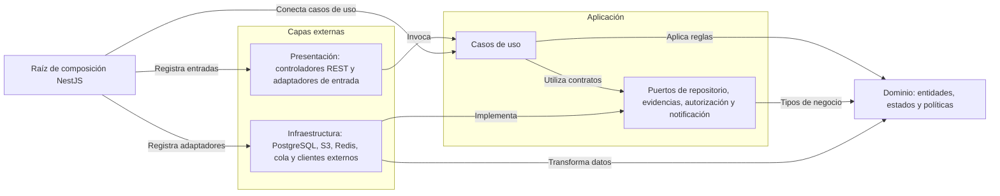

# Enfoque Clean Architecture de SIFITUR Huamanga

## Propósito y problema que resuelve

Se propone Clean Architecture para organizar las responsabilidades internas de SIFITUR y controlar las dependencias hacia su núcleo de negocio. Las reglas de fiscalización, riesgo y subsanación deben conservarse aunque cambien NestJS, Flutter, PostgreSQL o los servicios institucionales.

El estilo global se describe en [estilo arquitectónico](../estilo-arquitectonico.md). Este enfoque desarrolla ADR-002 y facilita responder a DA02 (operación offline), DA05 (integridad de evidencias) y DA06 (integraciones), además del objetivo de mantenibilidad de la Guía 03.

## Capas y responsabilidades

| Capa | Responsabilidad | Ejemplos propuestos | Dependencias permitidas |
|---|---|---|---|
| Dominio | Entidades, estados y reglas del proceso. | Prestador, VigenciaDocumental, Acta, Evidencia, ExpedienteSubsanacion, política de riesgo. | Tipos y reglas propios del dominio. |
| Aplicación | Orquestar casos de uso, controlar operaciones autorizadas y definir puertos necesarios. | RegistrarInspeccion, SincronizarActa, EvaluarDescargo, ConsultarFormalidad; RepositorioActas y AlmacenEvidencias. | Dominio y contratos propios de aplicación. |
| Presentación | Convertir entradas de clientes en solicitudes de casos de uso y representar resultados. | Controladores REST, DTO de transporte, validadores de formato y pantallas. | Interfaces de aplicación; dominio cuando sea necesario. |
| Infraestructura | Implementar persistencia, red, almacenamiento, mensajería y mecanismos técnicos. | RepositorioPostgres, AlmacenS3, CacheRedis, PublicadorRabbitMQ, clientes SUNAT y MINCETUR. | Puertos de aplicación y tipos de dominio. |

Los decoradores de NestJS, entidades ORM, tokens de inyección y clientes de proveedores permanecen en las capas externas. Aplicación usa estructuras simples para sus solicitudes y resultados; presentación transforma los DTO HTTP y no expone directamente filas de base de datos.

El boilerplate Marketplace coloca contratos dentro de `dominio/contratos`. Para SIFITUR se propone `aplicacion/puertos` cuando el contrato pertenece a una necesidad del caso de uso, como guardar un acta o solicitar una notificación. Ambas ubicaciones pueden respetar la dependencia hacia el interior; lo esencial es que el contrato no pertenezca al adaptador concreto.

## Diagrama de dependencias de código

Las flechas representan dependencia de código o implementación de un contrato. No representan el recorrido de una petición ni la dirección de acceso a los servidores.



No existe una dependencia de dominio hacia infraestructura. En ejecución, un caso de uso llama a un puerto cuya implementación accede a PostgreSQL o S3; esa llamada no requiere importar el SDK o el repositorio concreto en el caso de uso.

## Estructura de proyecto propuesta

La siguiente estructura es una propuesta para una implementación futura. Estas carpetas y clases todavía no existen en el repositorio documental.

```text
sifitur/
├── backend/
│   └── src/
│       ├── modulos/
│       │   ├── identidad/
│       │   ├── padron/
│       │   ├── operativos/
│       │   ├── fiscalizacion/
│       │   │   ├── dominio/
│       │   │   │   ├── entidades/          # Acta, Inspeccion, Evidencia
│       │   │   │   └── reglas/             # Estados y validaciones del acta
│       │   │   ├── aplicacion/
│       │   │   │   ├── casos-de-uso/       # RegistrarInspeccion, SincronizarActa
│       │   │   │   ├── puertos/            # RepositorioActas, AlmacenEvidencias
│       │   │   │   └── datos/              # Solicitudes y resultados simples
│       │   │   ├── presentacion/           # Controladores y DTO HTTP
│       │   │   └── infraestructura/        # PostgreSQL, S3 y outbox
│       │   ├── subsanaciones/
│       │   ├── riesgo/
│       │   ├── consulta/
│       │   └── auditoria/
│       └── composicion/                    # Módulos NestJS e inyección
├── trabajador/                             # Entrada para tareas asíncronas
├── app-movil/
│   └── lib/
│       ├── dominio/                        # Modelo local y reglas de captura
│       ├── aplicacion/                     # Guardar borrador y sincronizar
│       ├── presentacion/                   # Pantallas y estado de interfaz
│       ├── infraestructura/                # SQLite, cámara, GPS y REST
│       └── composicion/                    # Conexión de adaptadores
└── web/
    ├── consola-administrativa/              # React
    ├── portal-administrado/                 # React
    └── portal-ciudadano/                    # Next.js
```

Los demás módulos del backend siguen la separación mostrada para fiscalización. Se comparten contratos publicados, no repositorios privados. En los portales se separan vistas, coordinación de acciones y adaptadores REST; las reglas institucionales definitivas se validan siempre en backend. El cliente móvil puede aplicar validaciones locales para orientar la captura, sin sustituir la validación final del servidor.

## Asignación de reglas y servicios

| Responsabilidad | Ubicación | Motivo |
|---|---|---|
| Calcular días restantes de un documento y detectar vencimiento próximo a 30 días. | Dominio de padrón. | Es una regla del proceso, independiente del almacenamiento. |
| Clasificar riesgo con criterios y ponderaciones versionados. | Dominio de riesgo. | Las categorías son de negocio; las ponderaciones requieren definición institucional. |
| Determinar si un descargo puede recibirse según el estado y plazo. | Dominio de subsanaciones. | La validez del cambio pertenece al expediente. |
| Verificar permiso del actor y orquestar sincronización. | Aplicación de fiscalización. | Coordina identidad, reglas y persistencia por contratos. |
| Obtener fotografía de cámara y coordenadas GPS. | Infraestructura móvil. | Depende de APIs del dispositivo; aplicación exige los datos necesarios. |
| Generar PDF, calcular hash y guardar objeto. | Infraestructura mediante puertos de aplicación. | Depende de bibliotecas y proveedores técnicos. |
| Limitar peticiones, validar JWT y conectar permisos. | Gateway y adaptadores de seguridad del backend. | Son mecanismos técnicos; el caso de uso requiere un actor autorizado. |
| Aplicar reglas de rol y propiedad del expediente. | Política de autorización consumida por aplicación. | La autorización de negocio debe existir aun sin controlador HTTP. |
| Mapear respuestas SUNAT/MINCETUR y tratar fallos de red. | Infraestructura de integración. | El negocio no debe conocer el formato del proveedor. |

## Ejemplo de flujo: sincronizar un acta

1. La presentación móvil solicita sincronizar un registro pendiente guardado por el caso de uso local.
2. El adaptador REST transmite la operación con un identificador estable, versión y evidencias referenciadas.
3. El controlador backend valida el formato, obtiene la identidad autenticada y llama a `SincronizarActa`.
4. El caso de uso verifica permisos y duplicados, aplica las reglas de dominio y verifica que las evidencias se hayan persistido por el puerto correspondiente.
5. Un puerto de unidad de trabajo confirma acta, referencias, auditoría y tarea outbox dentro de la transacción PostgreSQL. El archivo en S3 se coordina por estados y recuperación, no por una transacción compartida.
6. El caso de uso devuelve confirmación durable o un conflicto explícito. El móvil conserva la copia pendiente si falta confirmación.
7. El publicador y trabajador completan las tareas de documento y notificación. Sus reintentos no duplican operaciones confirmadas.

La interfaz no calcula riesgo institucional ni decide por sí sola que un expediente quedó subsanado. Tampoco accede directamente a PostgreSQL o usa credenciales de S3.

## Reglas de dependencia y verificación futura

- Dominio no importa NestJS, React, Flutter, ORM, HTTP, SQLite ni SDK de proveedores.
- Aplicación no instancia repositorios concretos ni usa decoradores del framework.
- Presentación no reemplaza reglas de negocio con condiciones de pantalla.
- Infraestructura implementa contratos; la raíz de composición elige implementaciones.
- Las pruebas de dominio y aplicación usan reloj controlado y adaptadores en memoria. Las pruebas de integración verifican PostgreSQL, archivos y mensajería por separado.
- Una revisión de importaciones y reglas automáticas de dependencia deberá impedir referencias del núcleo a capas externas cuando exista código.
