# Estilo arquitectónico de SIFITUR Huamanga

## Selección y alcance

Se propone una organización **cliente-servidor multicanal con backend como monolito modular**. Los módulos de negocio pertenecen a una aplicación backend Node.js/NestJS; las instancias de esa aplicación pueden replicarse detrás de un gateway y balanceador. El trabajador de tareas asíncronas utiliza los mismos contratos de aplicación y se ejecuta por separado.

Las aplicaciones Flutter, React y Next.js, los almacenes y el trabajador tienen despliegues propios. Por ello, un monolito modular en el backend no significa que toda la plataforma opere en un único proceso. El procesamiento con cola complementa el estilo global y no exige microservicios por cada módulo.

La selección desarrolla ADR-001 y responde a DA03 (demanda estacional) y al objetivo de costos RNF-08 de la propuesta. Clean Architecture define las dependencias dentro de los módulos en el [documento de enfoque](enfoque/enfoque-arquitectonico.md).

## Componentes y responsabilidades

| Componente | Responsabilidad | Requisitos o drivers |
|---|---|---|
| Aplicación móvil Flutter | Capturar actas, firmas y fotos; conservar datos localmente y sincronizar. | RF03, RF09, RF10, RF11; DA02 |
| Consola administrativa React | Administrar usuarios, padrón y operativos; evaluar subsanaciones y consultar indicadores. | RF02, RF05-RF08, RF12, RF14 |
| Portal del administrado React | Consultar el expediente propio y adjuntar descargos autorizados. | RF12 |
| Portal ciudadano Next.js | Consulta abierta de prestadores y resolución de QR con datos públicos. | RF13; DA04 |
| CDN y gateway/balanceador | Distribuir recursos estáticos, enrutar peticiones y aplicar protección perimetral. | DA01, DA03, DA04 |
| Backend modular NestJS | Ejecutar casos de uso, validar permisos y coordinar persistencia e integraciones. | DA01-DA06 |
| PostgreSQL primaria | Mantener datos institucionales, expedientes, auditoría y tareas pendientes. | RF04-RF12; DA05 |
| PostgreSQL réplica | Atender reportes y lecturas que toleran un desfase definido. | RF14; DA03 |
| Redis | Acelerar consultas de la proyección pública del padrón y QR. | RF13; DA04 |
| Almacenamiento S3 compatible | Custodiar fotos originales, documentos y sus versiones. | RF10, RF11; DA05 |
| RabbitMQ y trabajador | Procesar tareas de documentos, actualización de proyecciones y notificaciones con reintentos. | DA05, DA06 |
| Adaptadores externos | Encapsular consultas a SUNAT, MINCETUR, GIS y envío de SMS/correo. | RC06; DA06 |

## Diagrama de estructura global

El diagrama representa comunicación en ejecución y unidades del diseño propuesto. Las flechas no representan importaciones de código; las dependencias de código se muestran en el enfoque.

```mermaid
flowchart TB
    Inspector["Inspector de campo"] --> Movil
    Coordinador["Coordinador"] --> AdminWeb
    Administrador["Administrador TI"] --> AdminWeb
    Prestador["Prestador turístico"] --> AdministradoWeb
    Ciudadano["Turista / ciudadano"] --> PublicoWeb

    subgraph SIFITUR["SIFITUR Huamanga - estructura propuesta"]
        Movil["App Flutter"] -->|Persistencia offline| SQLite[("SQLite local cifrada")]
        AdminWeb["Consola React"]
        AdministradoWeb["Portal del administrado React"]
        PublicoWeb["Portal público Next.js"]
        CDN["CDN - recursos estáticos"] --> PublicoWeb
        Gateway["Gateway / balanceador NGINX y WAF"]
        Movil -->|HTTPS REST privado| Gateway
        AdminWeb -->|HTTPS REST privado| Gateway
        AdministradoWeb -->|HTTPS REST privado| Gateway
        PublicoWeb -->|HTTPS REST público| Gateway

        subgraph Backend["Backend modular NestJS - instancias sin estado"]
            Entradas["Controladores y autorización"]
            Identidad["Identidad y permisos"]
            Padron["Padrón y vigencias"]
            Operativos["Operativos y rutas"]
            Fiscalizacion["Fiscalización y evidencias"]
            Subsanaciones["Subsanaciones"]
            Riesgo["Riesgo"]
            Consulta["Consulta pública e indicadores"]
            Auditoria["Auditoría"]
            Adaptadores["Adaptadores de persistencia e integración"]
            Entradas --> Identidad
            Entradas --> Padron
            Entradas --> Operativos
            Entradas --> Fiscalizacion
            Entradas --> Subsanaciones
            Entradas --> Riesgo
            Entradas --> Consulta
            Entradas --> Auditoria
            Identidad --> Adaptadores
            Padron --> Adaptadores
            Operativos --> Adaptadores
            Fiscalizacion --> Adaptadores
            Subsanaciones --> Adaptadores
            Riesgo --> Adaptadores
            Consulta --> Adaptadores
            Auditoria --> Adaptadores
        end

        Gateway -->|REST| Entradas
        Adaptadores -->|SQL - escrituras y datos actuales| Primaria[("PostgreSQL primaria + outbox")]
        Primaria -->|Replicación| Replica[("PostgreSQL réplica de lectura")]
        Adaptadores -->|SQL - reportes| Replica
        Adaptadores -->|RESP - consulta pública| Redis[("Redis")]
        Adaptadores -->|S3 API| Objetos[("Objetos - fotos y PDF")]
        Publicador["Publicador de tareas pendientes"] -->|Lee outbox| Primaria
        Publicador -->|AMQP| Cola["RabbitMQ"]
        Cola --> Trabajador["Trabajador asíncrono"]
        Trabajador -->|Estado y auditoría| Primaria
        Trabajador -->|S3 API| Objetos
        Trabajador -->|Actualización / invalidación| Redis
    end

    Adaptadores -->|Consulta mediante API habilitada| Sunat["SUNAT RUC"]
    Adaptadores -->|Consulta mediante API habilitada| Mincetur["MINCETUR"]
    Adaptadores -->|Servicio cartográfico| GIS["OpenStreetMap / GIS"]
    Trabajador -->|Adaptador SMS / correo| Notificaciones["Pasarela de notificaciones"]
```

## Límites entre módulos

| Módulo | Información y reglas propias | Interacción permitida |
|---|---|---|
| Identidad | Usuarios, roles y permisos. | Expone verificación de permisos a casos de uso privados. |
| Padrón y vigencias | Prestadores y documentos habilitantes. | Expone consultas de prestador y cambios de vigencia. |
| Operativos | Campañas, asignaciones y rutas. | Consulta padrón y riesgo por interfaces de aplicación. |
| Fiscalización | Inspecciones, actas y referencias de evidencias. | Consulta asignación y prestador; solicita tareas y registra auditoría. |
| Subsanaciones | Descargos, evaluación y plazos del expediente. | Consulta actas y comunica el resultado autorizado al padrón. |
| Riesgo | Clasificación de criticidad y versión de reglas. | Recibe antecedentes necesarios sin leer tablas ajenas directamente. |
| Consulta e indicadores | Proyecciones públicas y agregados territoriales. | Consume cambios confirmados y consultas autorizadas. |
| Auditoría | Eventos de acciones sensibles. | Recibe registros; expone lectura solo a permisos específicos. |

## Reglas de organización y despliegue

1. Ningún módulo consulta directamente tablas o repositorios internos de otro módulo. La base puede ser compartida físicamente, pero cada módulo conserva propiedad lógica sobre sus datos.
2. La autorización se valida en backend; el gateway no sustituye los permisos de negocio. Las rutas QR públicas no requieren JWT.
3. Las instancias del backend no conservan archivos definitivos ni estado de sesión dependiente de una sola máquina.
4. La primaria confirma cambios del expediente. Réplica y caché no deciden una transición que exige el estado actual.
5. Los trabajos asíncronos tienen identificador, estado, reintentos y recuperación. Se confirma la captura definitiva solo después de verificar su persistencia durable.
6. Replicación no equivale a copia de seguridad ni garantiza conmutación automática. Alta disponibilidad de gateway, base, cola y caché requiere configuración y pruebas específicas.

## Alternativas y compensaciones

Microservicios aportarían despliegue y escalado por módulo, pero exigirían contratos distribuidos, observabilidad y coordinación de datos adicionales. El volumen estimado no demuestra por sí solo que sean necesarios. Se prefiere empezar con módulos delimitados y medir antes de separar servicios.

El monolito modular simplifica el desarrollo y la operación, pero sus módulos comparten el despliegue y recursos del backend. Caché, réplica y tareas asíncronas agregan complejidad de consistencia y recuperación. La disponibilidad y latencia de AC01-AC03 son metas pendientes de validar, no propiedades garantizadas por el diagrama.

## Referencias

- GUIA-003-ASF.pdf, paso 4 y tarea de la sección VII.
- Propuesta SIFITUR Huamanga, secciones 1 y 4, componentes HLD y contenedores.
- [Decisiones arquitectónicas](../analisis-de-sistema/07-decisiones-arquitectonicas.md).
- [Arquitectura inicial](arquitectura-inicial.md), antecedente del diseño global.
